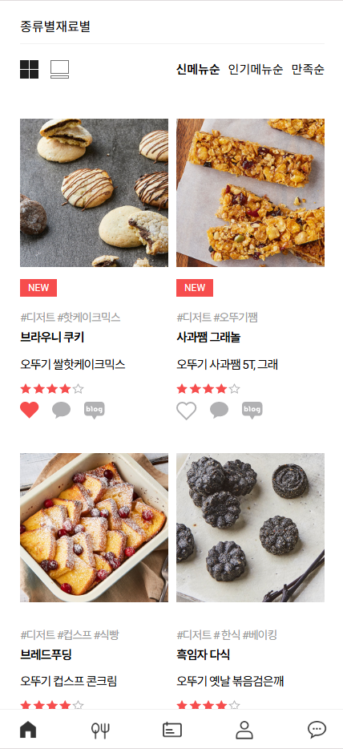

# O_kichen

> 모바일 사용자의 환경을 이해하고 그에 맞춘 최적화된 환경을 제공하기 위해 모바일 전용 애플리케이션을 만들었습니다.  
> [🔗 site](https://yuna-77.github.io/o_kichen/)

2024.10 ~

## Overview ⭐️

✅ Google Map API 활용으로 보다 정확한 위치 구현  
✅ Swiper를 활용해 보다 동적인 디자인 구현  
✅ 모바일 전용으로 최적화  
✅ 별점, 가격, 링크 등을 기준으로 상품 리스트를 세분화하여 제공    
  

## 사용 기술 스택 🔧

- **Frontend** : HTML, CSS, JavaScript
- **Library** : SwiperJS,Google Map API
- **SCM** : Git, GitHub
- **Design** : Figma
- **Platform**: Mobile(APP)

    
## 주요 기능 ⚙️

### [상품 리스트]

|recipe_list|
|:---:|
||
|상품 리스트를 만들어서 사용자의 선택,비교가 가능하게 도와줍니다.|  

- 각 상품에 대한 상세 정보나 구매 페이지로 바로 이동할 수 있는 빠른 링크를 제공하여, 사용자가 필요할 때 손쉽게 추가 정보나 구매를 할 수 있도록 돕습니다.
- 가격대 별로 상품을 필터링 하여 예산에 맞는 제품을 쉽게 찾을 수 있도록 했습니다.
- 다양한 가격 범위를 제공해 사용자가 원하는 가격대에서 제품을 쉽게 선택하고 비교할 수 있습니다.

### [Google Map API]

- Google Maps JavaScript API를 활용하여 지정된 위도와 경도에 해당하는 위치를 지도에 표시하는 시스템을 구현 할 수 있게 되었다.
- 지도를 모바일 페이지에 삽입하고 사용자가 제공한 위도와 경도를 기반으로 지도의 중심을 설정합니다. 이를 통해 사용자는 지도에서 정확한 위치를 확인할 수 있습니다.
  
## 후기 ⌨️

이번 작업은 구글 맵,모바일 전용을 중점으로 생각하였습니다.

지도는 사이트에서 매우 중요한 부분으로 정보 제공에 필수 사항이기에 이를 배우고 적용 하는 과정이 중요한 경험으로 남았습니다.

모바일 전용으로 만드는 것은 웹과 모바일 전용과는 다른 부분이 있기에 화면 크기와 터치 인터페이스, 터치 기반의 직관적인 사용성에 대해 생각을 했습니다. 이러한 요소들을 잘 반영하여 다음 프로젝트에서도 사용자 친화적인 경험을 제공 할 수 있을 것 같습니다.
